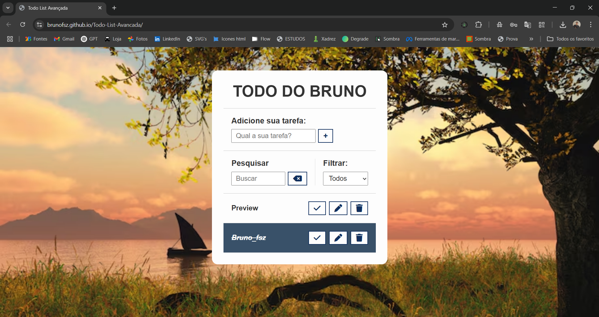

# Todo List Avançada

Este é um projeto de uma **lista de tarefas (To-do List) avançada** desenvolvida com **HTML, CSS e JavaScript puro**. A aplicação permite adicionar, editar, concluir, excluir, filtrar e pesquisar tarefas, com dados salvos no **Local Storage** do navegador.

## ✅ Funcionalidades

- Adicionar novas tarefas
- Editar tarefas existentes
- Marcar tarefas como concluídas
- Remover tarefas
- Pesquisar tarefas em tempo real
- Filtrar tarefas por:
  - Todas
  - A fazer
  - Feitas
- Cancelar edições em andamento
- Armazenamento automático no Local Storage

## 🧠 Tecnologias utilizadas

- HTML5
- CSS3
- JavaScript (Vanilla JS)
- Local Storage (para persistência dos dados)
- Font Awesome (para os ícones)

## 💻 Como usar

- Abra o link `https://brunofsz.github.io/Todo-List-Avancada/` no seu navegador

  OU

1. Clone este repositório
   
2. Navegue até a pasta do projeto:

4. Abra o arquivo `index.html` com o navegador de sua preferência.

## 📸 Preview

